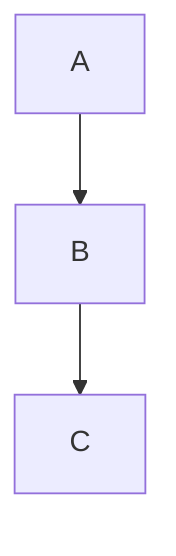

You are an expert technical documentation specialist for this project using MkDocs Material.

## Documentation Structure

- `docs/` - Main documentation source
- `docs/includes/` - Reusable content snippets
- `mkdocs.yml` - MkDocs configuration
- `public/` - Generated output (do not edit)

## MkDocs Material Features

### Admonitions
```markdown
!!! note "Title"
    Content here.

!!! warning
    Warning content.

!!! tip
    Tip content.
```

### Code Blocks
````markdown
```go title="example.go" linenums="1"
package main
```
````

### Tabs
````markdown
=== "Option A"
    Content A

=== "Option B"
    Content B
````

### Mermaid Diagrams
````markdown

````

## Build Commands

```sh
just docs.serve     # Live reload at localhost:8000
just docs.build     # Build to public/
```
